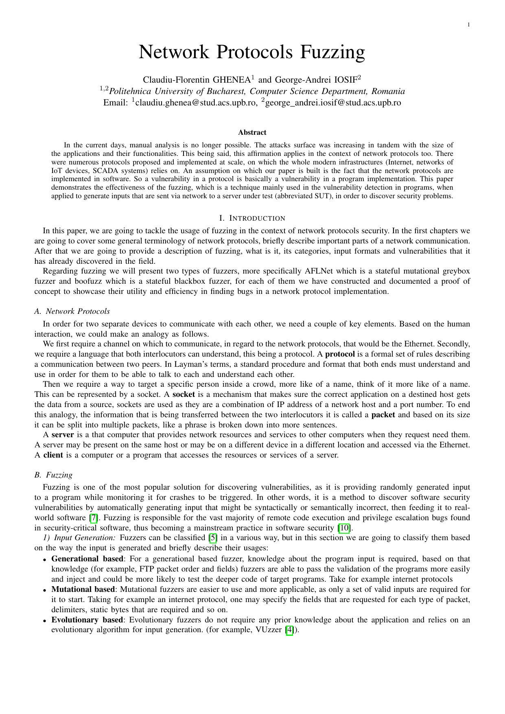

# Network Protocols Fuzzing

## Description 🖼️

This repository contains an essay about the **usage of fuzzing for finding vulnerabilities in network protocols**. This was created for a course from Faculty of Automatic Control and Computers, University POLITEHNICA of Bucharest, namely "*Security Protocols*".

## Folders Structure 📁

The folder structure is as follows:
- **[`demos`](demos)**: Two proof of concepts, for boofuz and AFLNet.
- **[`essay`](essay)**: The LaTeX project and the exported essay.
- **[`presentation`](presentation)**: The exported Google Slides presentation.

## Preview 👀

| Essay                                                                                                        | Presentation                                                                                                                         |
|--------------------------------------------------------------------------------------------------------------|--------------------------------------------------------------------------------------------------------------------------------------|
| <a href="essay/essay.pdf"><kbd></kbd></a> | <a href="presentation/presentation.pdf"><kbd></kbd></a> |

## Contributors

- Claudiu-Florentin GHENEA ([@Phineas09](https://github.com/Phineas09))
- George-Andrei IOSIF ([@iosifache](https://github.com/iosifache))